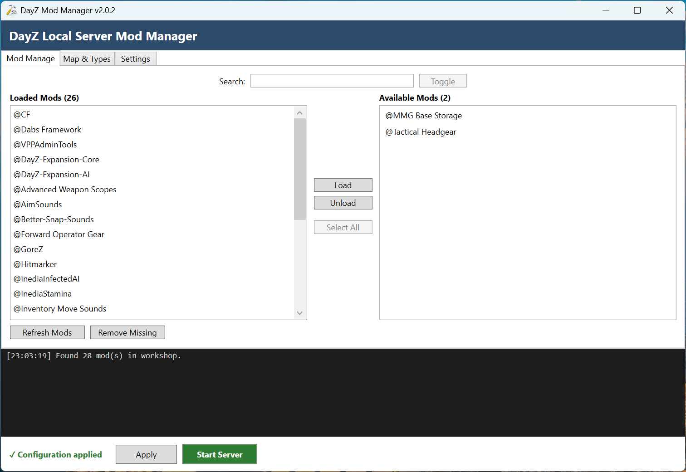
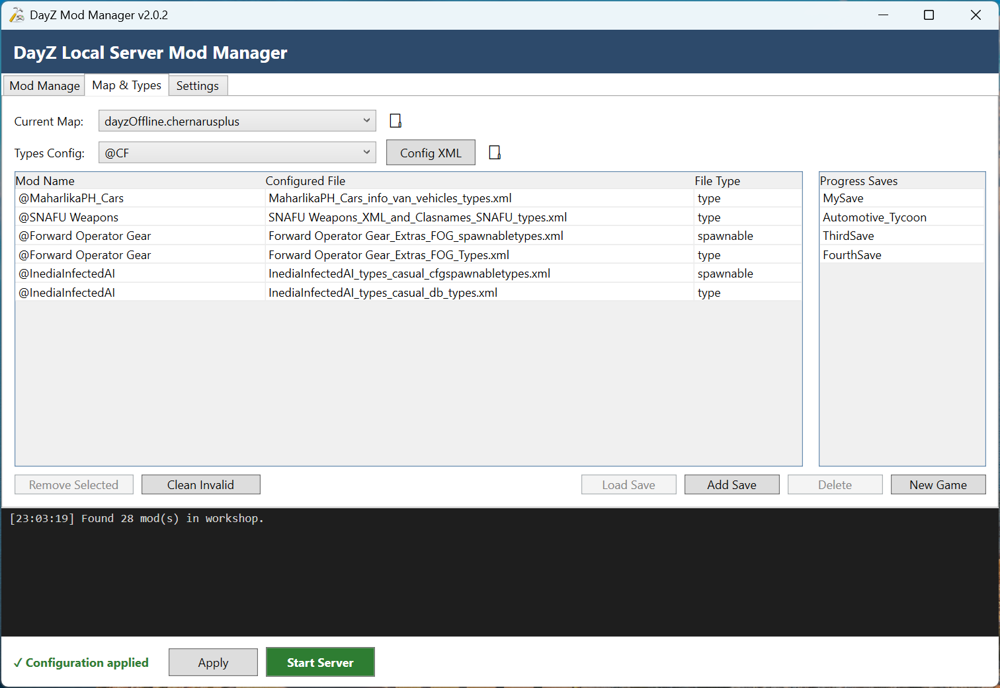

# DayZ Local Server Mod Manager V2

> **A Windows desktop mod manager for heavily modded DayZ local servers and single-player PvE.**

**DayZ Local Server Mod Manager V2** brings mod selection, load order, junction management, launch-batch configuration, map switching, `types.xml` integration, and world-progress saves into one graphical application.

V2 is the successor to the original [DayZ Local Server Mod Manager](https://github.com/RichardVincent1324/DayZ-Local-Server-Mod-Manager), completely rebuilt with **C# / .NET 8 and WPF**.

---

## Screenshots






---

## ⬇️ Download

### [Download DayZ Local Server Mod Manager V2](https://github.com/RichardVincent1324/DayZ-Local-Server-Mod-Manager-V2/releases/latest)

**Latest stable release: v2.0.2**

* Windows x64
* Self-contained
* No separate .NET runtime installation required
* Single executable

> V2 manages an existing DayZ Server installation. It does **not** install or replace DayZ Server itself.

---

## What does V2 do?

Managing a heavily modded DayZ local server usually means repeatedly dealing with Workshop folders, load order, junctions, batch-file parameters, mission files, XML configuration, map profiles, and save data.

V2 puts that workflow into one Windows application so you can spend less time editing files by hand and more time playing.

### Typical workflow

```text
DayZ Workshop Mods
        ↓
DayZ Local Server Mod Manager V2
        ↓
Mods / Load Order / Junctions / Map / Types / Saves
        ↓
Local DayZ Server
        ↓
DayZ Client
```
---

# Getting Started

## 1. Install and initialize DayZ Server

Make sure you already have:

- DayZ installed.
- DayZ Server installed (via Steam).
- Your DayZ Server folder available locally.

It is a good idea to run the server at least once so the normal configuration and mission folders exist, including files such as `serverDZ.cfg` and the `mpmissions` directory.

## 2. Download V2

Download the latest release:

**https://github.com/RichardVincent1324/DayZ-Local-Server-Mod-Manager-V2/releases/latest**

## 3. Download the required launch batch file

The V2 repository does **not** currently provide `LocalServer.example.bat`.

Get it from the original project:

**https://github.com/RichardVincent1324/DayZ-Local-Server-Mod-Manager/blob/main/LocalServer.example.bat**

Place a copy in your DayZ Server root. For example:

```text
D:\DayZServer\LocalServer.example.bat
```

The template contains variables V2 expects to work with, including settings similar to:

```bat
set "serverDirectory=C:\Path\To\DayZServer"
set "modList=-mod=;"
set "serverProfile=map_profiles\dayzOffline.chernarusplus"
```

At minimum, change `serverDirectory` to your actual DayZ Server installation path. You can also adjust the server port, CPU count, and other launch settings in the template if required.

> [!WARNING]
> After V2 is configured to use the batch file, do not manually maintain the `modList` block. V2 owns and rewrites that portion when applying your mod configuration.

## 4. Configure V2 Settings

Open V2 and configure:

- **Workshop path** — the directory containing your installed `@...` mod folders, commonly:

  ```text
  <SteamLibrary>\steamapps\common\DayZ\!Workshop
  ```

- **Server path** — the directory containing `DayZServer_x64.exe` and `serverDZ.cfg`.
- **Batch file** — the `LocalServer.example.bat` file you prepared in the previous step. Select it manually on first run; V2 does not preselect a default batch file, and the server cannot be started until one is chosen.

## 5. Configure the local server for this workflow

V2 is designed for local/solo play and does not manage DayZ `.bikey` / `.bisign` signature deployment.

For the intended local-server workflow, open your `serverDZ.cfg`.
DayZ default value is:
```cfg
verifySignatures = 2;   // Verifies .pbos against .bisign files. (only 2 is supported)
```
Locate this existing line and change value from `2` to `0`. Do not insert a duplicate new entry.
```cfg
verifySignatures = 0;
```
`verifySignatures = 0` disables PBO signature verification, required for this local‑mod workflow.

> [!CAUTION]
> This setup is intended for a private local server. Do not use V2 as a public-server security or signature-management solution.


## 6. ✅ Setup complete :tada::confetti_ball:
> Your local DayZ server environment is ready. Continue below to learn about available features.

---

## Features

### Mod management

- Discover installed DayZ Workshop mods from the configured Workshop directory.
- Separate mods into **Loaded** and **Available** lists.
- Search your installed mods from the same interface.
- Load or unload mods quickly.
- Reorder the active load order with drag-and-drop.
- Remove missing mods that are no longer present on disk.
- Apply the selected configuration to the local server.

### Junction and batch-file management

- Loaded mods are exposed to the server as Windows directory junctions inside a dedicated `ModList` folder.
- Uses server-root-relative mod paths such as `ModList/@CF`.
- Rewrites the batch file's manager-owned `modList` block when applying changes.
- Writes large mod lists across multiple valid `cmd` lines rather than creating one unmanageable command line.
- Reconciles existing managed junctions during Apply.
- Validates and prepares changes before destructive junction cleanup, reducing the chance that a failed Apply leaves the server configuration broken.

### Map & Types

- Discover maps from the server's `mpmissions` directory.
- Switch the active map from the UI.
- Update the active mission template in `serverDZ.cfg`.
- Update the batch file's `serverProfile` and corresponding `map_profiles` location.
- Discover **every** XML file in a mod (recursively).
- Files whose names contain `type` or `spawnable` are **recognized** and classified automatically. All other files are listed separately at the bottom of the picker, where you assign each one a **Types** or **Spawnable** role.
- A mod may include any number of `types` and `spawnable` files.
- Use the picker's **Open mod folder** button to inspect unrecognized files in File Explorer before assigning a role.
- Copy the selected files into the active mission's `db/ModTypes` directory.
- Store each file's role in `types_config.json`; the role drives the `type` attribute and the types-before-spawnable ordering in `cfgeconomycore.xml`.
- The types grid shows **Mod Name**, **Configured File**, and **File Type** (`type` or `spawnable`), so the assigned role is visible at a glance.
- Keep `cfgeconomycore.xml` synchronized with manager-owned types entries.
- Preserve entries that V2 does not own.
- Detect untracked XML files in `db/ModTypes` so orphaned files are visible instead of silently remaining active.
- Ask for confirmation before overwriting or deleting configured types files.
- Support `Remove Selected` and `Clean Invalid` maintenance operations.
- Lock types editing once a world exists (`storage_<instanceId>` present), because DayZ only reads these files when a new world is created; `New Game` unlocks it.
- Open the active mission's `db/ModTypes` folder, or the `map_profiles` folder, directly in File Explorer from the buttons beside **Config XML** and **Current Map**.

### Progress saves

- Save the current world progress for the active map.
- Uses the active `storage_<instanceId>` folder, with the instance ID read from `serverDZ.cfg` and defaulting to `1` when appropriate.
- Store named saves per map.
- Save a snapshot of the mission's `db/ModTypes` alongside the world data.
- Store save metadata in `meta.json`, including map information, save time, mod order, active types files, and the map's types mapping.
- Add, load, and delete named saves.
- Start a new game from the manager.
- Load a save by pointing `cfgeconomycore.xml` at the save's own `db/ModTypes` copy, so the world reads its saved types while the configured `db/ModTypes` files and `types_config.json` stay untouched.
- Restore the loaded mod list to match the save's mod list on load: the launch batch, `mod_order.json` and junctions are updated, and mods not in the save are unloaded (their Workshop folders are never deleted).
- Block loading a save whose mods are missing from the Workshop, listing them in a red warning.
- While a save is loaded, mods added afterwards are appended to that save's `meta.json` ModList so the save keeps track of them.
- Keep the configured types in the live `db/ModTypes` folder. Loading a save points `cfgeconomycore.xml` at the save's own `ModTypes` copy instead of overwriting the configured files, so `New Game` simply points it back — the configured types are never displaced.
- Stage save loading so an interrupted operation does not immediately destroy the current world progress.

### Settings and data storage

V2 keeps its configuration and save data in a dedicated data directory.

Before a server path is configured:

```text
%LOCALAPPDATA%\DayZ-Mod-Manager-V2
```

After a server path is configured:

```text
<serverPath>\DayZ-Mod-Manager-V2
```

Typical contents include:

```text
DayZ-Mod-Manager-V2\
├─ settings.json
├─ mod_order.json
├─ types_config.json
└─ Progress_Saves\
   └─ <mapName>\
      └─ <saveName>\
         ├─ storage_<id>\
         ├─ meta.json
         └─ ModTypes\
```

---

Your environment is now fully configured. Use V2’s user interface to manage mods, map/types settings, save profiles and start your local server.

> Always stop the DayZ server before performing operations that alter the active world state: switching maps, modifying types configs, loading saves or starting a new game.

---

## Upgrading from an earlier version

> [!IMPORTANT]
> Version **v2.0.2 changed how `types` roles are stored**. Do not reuse the `DayZ-Mod-Manager-V2` data folder or progress saves created by v2.0.1: its `types_config.json` and `meta.json` contain no role data, so every file would be treated as a `types` file. Start fresh instead.

Before upgrading, complete the following steps:

### Clean up the old v2.0.1 instance
1. Back up the `storage_<instanceId>` and `ModTypes` folders from `DayZ-Mod-Manager-V2\Progress_Saves\<map_name>\<save_name>`.
2. Back up `meta.json`. The legacy `meta.json` is only used to identify your previously loaded mods and is incompatible with v2.0.2.
3. Launch the old v2.0.1 build of DayZ Mod Manager.
4. Unload all mods via the **Mod Management** tab, then remove all configured types files using the [Remove Selected] button in the **Map & Types** tab.
5. Close the application and delete the v2.0.1 executable.
6. Delete the `DayZServer\DayZ-Mod-Manager-V2` and `%LOCALAPPDATA%\DayZ-Mod-Manager-V2` data directories.

### Restore your saves inside v2.0.2
1. Manually load your previously used mods by referencing the `ModList` stored in the backed-up legacy `meta.json`.
2. Configure your types files in v2.0.2 using the filenames from your `ModTypes` backup with the [Config XML] button.
3. Copy your backed-up `ModTypes` folder to overwrite the newly created `ModTypes` folder generated by v2.0.2.
4. Copy the `storage_<instanceId>` folder into `mpmissions\<current_map>`.
5. Click the [Add Save] button located in the **Map & Types** tab of v2.0.2.

---

## Required batch-file notes

The downloaded `LocalServer.example.bat` is not just a convenience sample. It provides the launch structure V2 is designed to manage.

The template includes, among other settings:

- `serverDirectory` — location of the DayZ Server installation.
- `serverProfile` — active map profile directory.
- `modList` — managed by V2 after setup.
- `serverPort` — DayZ Server port.
- `serverConfig` — normally `serverDZ.cfg`.
- `serverCPU` — CPU count passed to the server.

The template also starts `DayZServer_x64.exe` and can launch the DayZ client through Steam.

**If you skip the batch-file setup, V2 will not have the expected launcher file to update and start, so the normal Apply / map-profile / server-launch workflow will not work as intended.**

---

## Important: local servers/solo play only

V2 is intentionally focused on local DayZ environments, solo play, and single-player PvE.

It does **not** provide a complete public-server administration stack and does not manage:

- `.bikey` deployment.
- `.bisign` files.
- Server-side signature verification workflows.
- Remote/headless server administration.

If you are running a public or shared dedicated server that requires proper signature verification and key management, use tooling designed for that use case.

---

## Server and file layout

A configured server may look similar to this:

```text
<serverPath>\
├─ DayZ-Mod-Manager-V2\
│  ├─ settings.json
│  ├─ mod_order.json
│  ├─ types_config.json
│  └─ Progress_Saves\
├─ LocalServer.bat
├─ ModList\
│  ├─ @CF                 -> junction to Workshop mod
│  ├─ @AnotherMod         -> junction to Workshop mod
│  └─ ...
├─ mpmissions\
│  └─ <mapName>\
│     └─ db\
│        └─ ModTypes\
├─ map_profiles\
│  └─ <mapName>\
├─ serverDZ.cfg
└─ DayZServer_x64.exe
```

---

## Safety behavior

V2 is designed to reduce accidental damage to your local server setup:

- Apply validates the environment before committing the configuration.
- Junction preparation happens before destructive cleanup.
- A failed batch-file write should not immediately remove junctions still referenced by the existing launcher configuration.
- Save loading is staged and can be rolled back if the operation fails.
- Save / Load / New Game operations are blocked while the DayZ Server process is running.
- Types configuration asks before overwriting or deleting managed files.
- Manager-owned changes are limited to the lines and files V2 is responsible for; unrelated configuration should be left alone.

Even so, keeping your own backup of important server configuration and save data is always recommended before major changes.

---

## Requirements

### For users

- 64-bit Windows.
- DayZ Standalone.
- A working local DayZ Server installation.
- Installed Workshop mods if you intend to use mods.
- A compatible launch `.bat` file — **download `LocalServer.example.bat` from the original repository as described above**.

### For developers

- Windows.
- [.NET 8 SDK](https://dotnet.microsoft.com/download/dotnet/8.0).
- Visual Studio 2022 or another .NET 8 / WPF-capable development environment.

---

## Build from source

Clone the repository:

```powershell
git clone https://github.com/RichardVincent1324/DayZ-Local-Server-Mod-Manager-V2.git
cd DayZ-Local-Server-Mod-Manager-V2
```

Build:

```powershell
dotnet build DayZModManagerV2.sln
```

Run the application:

```powershell
dotnet run --project src/DayZModManager.App
```

Run tests:

```powershell
dotnet test DayZModManagerV2.sln
```

### Publish a self-contained Windows x64 build

```powershell
dotnet publish src/DayZModManager.App `
  -c Release `
  -r win-x64 `
  --self-contained true `
  -p:PublishSingleFile=true `
  -p:IncludeNativeLibrariesForSelfExtract=true `
  -p:EnableCompressionInSingleFile=true `
  -p:DebugType=None `
  -p:DebugSymbols=false
```

---

## Project structure

```text
src/
├─ DayZModManager.Core/       # domain logic and services
└─ DayZModManager.App/        # WPF UI / MVVM application

tests/
├─ DayZModManager.Core.Tests/
└─ DayZModManager.App.Tests/
```

V2 separates its core server/mod-management logic from the WPF UI to make the application easier to maintain and test.

---

## V1 → V2

V2 is a full rewrite rather than only a visual refresh.

| V1 | V2 |
| --- | --- |
| PowerShell | C# / .NET 8 |
| PowerShell GUI | WPF / MVVM |
| Script-oriented architecture | Structured application architecture |
| Root-level mod junction workflow | Dedicated `ModList` junction folder |
| Basic map/types workflow | Integrated map, types, untracked-file, and safety handling |
| Limited save management | Named progress saves with metadata and `ModTypes` snapshots |
| Limited testability | Dedicated Core/App test projects |

The original repository remains important because it currently hosts the required `LocalServer.example.bat` template used to prepare V2's launch workflow.

---

## Troubleshooting

### V2 cannot find or update my batch file

Confirm that you downloaded the batch template from the original repository, placed a copy in your DayZ Server folder, and selected that file in V2 Settings.

**Template:**  
https://github.com/RichardVincent1324/DayZ-Local-Server-Mod-Manager/blob/main/LocalServer.example.bat

### The server does not start

Try running your prepared `LocalServer.bat` manually. Verify that:

- `serverDirectory` points to the correct folder.
- `DayZServer_x64.exe` exists in that folder.
- `serverDZ.cfg` exists.
- Your port and other launch settings are valid.

### Mods do not load correctly

Check that:

- The Workshop path points to the folder containing your `@...` mods.
- The desired mods are in the Loaded list.
- Apply completed successfully.
- The generated `ModList` junctions exist.
- The selected batch file contains the V2-managed mod list.
- `verifySignatures = 0;` is configured for the intended local/solo workflow.

### Custom items do not spawn

Check the **Map & Types** configuration and confirm that the required XML files are present in the active mission's `db/ModTypes` folder and referenced by `cfgeconomycore.xml`.

### Save / Load / New Game is unavailable

Stop the DayZ Server process first. V2 intentionally refuses world-changing save operations while the server is running.

---

## Contributing

Bug reports, suggestions, and improvements are welcome.

When reporting a problem, please include:

- What you were trying to do.
- What you expected to happen.
- What actually happened.
- Relevant error messages or screenshots.
- Your DayZ/server configuration when appropriate.

Issues and pull requests can be submitted through this repository.

---

## License

This project is licensed under the [MIT License](LICENSE).

---

## Disclaimer

This project is an independent community tool.

**DayZ** is a trademark of Bohemia Interactive. This project is not affiliated with or endorsed by Bohemia Interactive.

---

## Links

- [Download the latest V2 release](https://github.com/RichardVincent1324/DayZ-Local-Server-Mod-Manager-V2/releases/latest)
- [V2 repository](https://github.com/RichardVincent1324/DayZ-Local-Server-Mod-Manager-V2)
- [Original V1 repository](https://github.com/RichardVincent1324/DayZ-Local-Server-Mod-Manager)
- [Required `LocalServer.example.bat` template](https://github.com/RichardVincent1324/DayZ-Local-Server-Mod-Manager/blob/main/LocalServer.example.bat)
